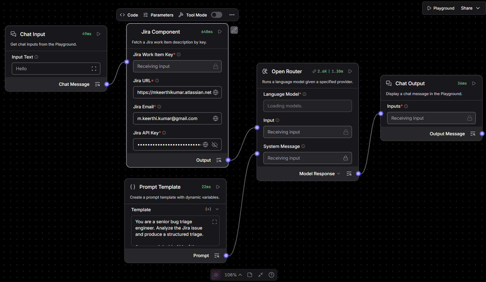

## Screenshots

## Jira Ticket Title
Inline validation is missing

## Jira Ticket Description

Steps to reproduce:

Go to the login page

Leave the Username field empty

Leave the Password field empty

Click the Log In button

Expected Result:

Login should not proceed. Inline validation should indicate that Username and Password are mandatory fields.

Actual Result:

The backend threw an error message “Your Username and Password did not match. Please check and try again”

## Agent's Full Output

**SEVERITY:** Major  
**PRIORITY:** P2  
**IMPACT_AREAS:** Authentication login form, Client-side form validation, User onboarding/access flow  
**ROOT_CAUSE_ANALYSIS:** The login form appears to lack frontend validation for required Username and Password fields, allowing empty submission to reach the backend, which returns a generic "Username and Password did not match" error instead of blocking submission early.  
**JUSTIFICATION:** Severity is **Major** because the core login journey's required-field validation is broken, directly impacting user experience on a critical flow, though core authentication remains functional when credentials are provided. Priority is **P2** because the system remains accessible with valid inputs, but the missing validation creates UX friction, potential support tickets, and confusion on the login page, warranting a medium-urgency fix.