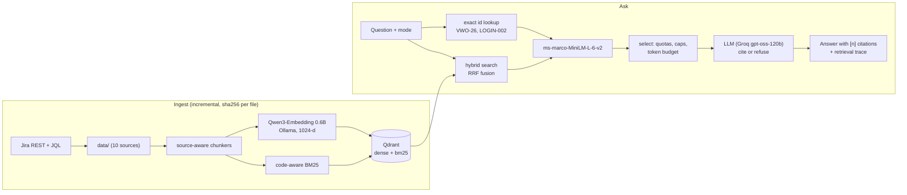

# QABuddy.ai: multi-source hybrid RAG for QA engineers

Ask one question, get one **cited** answer grounded in the team's Selenium and
Playwright frameworks, test case repository, Jira bugs, requirement documents,
meeting notes, Lucid charts and Jenkins logs. Open source where it matters: the embedding
model runs locally and the vector store is Qdrant — a local server or Qdrant Cloud.

```bash
./run.sh          # starts Ollama (and a local Qdrant unless you point at Cloud), ingests on first run, opens http://localhost:8300
```

Hosted demo: see the end of this file.

## The five decisions (from the build brief)

### 1. Embedding model: Qwen3-Embedding (0.6B, served by Ollama)

| Option | Why not / why |
|---|---|
| **Qwen3-Embedding-0.6B** ✅ | #1-family on MTEB (8B: 70.58 multilingual); 0.6B already beats BGE-M3 (64.3 vs ~63), light enough for CPU, and handles code natively. 32K-token inputs, Apache 2.0, instruction-aware queries, Matryoshka dims |
| Qwen3-Embedding-4B | Same family, higher quality but heavier; a drop-in upgrade (`EMBED_MODEL=qwen3-embedding:4b`) when the hardware allows |
| BGE-M3 | Its edge is dense + sparse + multi-vector in one model, but Ollama exposes only the dense half |
| EmbeddingGemma | 2,048-token input limit: too short for a Java class or a PRD section; Gemma licence |
| nomic-embed-text (chapter 10) | Older generation, weaker on code |

Settings: `qwen3-embedding:0.6b`, **1024 dims** (the model's native width; Matryoshka
truncation via Ollama's `dimensions` parameter), queries prefixed with a task instruction.
The 4B model is a drop-in upgrade on a GPU droplet (see `deploy/DEPLOY.md`).

### 2. Vector database: Qdrant

One collection, two named vectors per chunk: `dense` (Qwen3, cosine) and `bm25`
(sparse, with Qdrant's IDF modifier). One batched request runs dense, BM25 and Qdrant's
native RRF fusion; payload indexes allow filtering by source, ticket, test id, module,
build or test name. Apache 2.0; run it as a single binary or a container locally, or point
at a managed Qdrant Cloud cluster (`QDRANT_URL` + `QDRANT_API_KEY` in `.env`).
LanceDB was the runner-up (embedded, no server); Chroma, pgvector and Milvus were ruled
out for weak hybrid search, no native hybrid, and over-sized ops respectively.

### 3. Chunk size and overlap, per source

The rule: **chunk along the unit a QA engineer asks about**, never by character count alone.

| Source | Chunk unit | Target size | Overlap | Why |
|---|---|---|---|---|
| Test cases (CSV/XLSX) | one row | ~190 tokens | none | A test case is already atomic; splitting glues half of one case to the next (chapter 11) |
| + inventory chunks | 1 repository summary + 1 per module | ≤ 800 tokens | none | "Which features have **no** test cases?" asks about absence; top-k cannot prove absence |
| Jira tickets | summary + description; each comment separately | ≤ 500 tokens | 1 paragraph, only if split | Comments carry the root cause; they must be retrievable on their own |
| PRD / SRS / BRD / FRD, company docs (PDF/MD) | heading-aware section | 500 target, 700 max | ~15% (one block) when a section is split | Answers live in a section; tiny sibling sections are merged |
| + document outline | 1 per long document | ≤ 900 tokens | none | Lets an answer enumerate every requirement, not just the 6 retrieved |
| Meeting transcripts | speaker turns | ~400 tokens | 1 turn | A hand-off between speakers is never cut; decisions and action items get their own chunk |
| Lucid charts | one diagram page as node list + flows | ≤ 600 tokens | none | Flows reference their nodes, so a diagram stays together |
| Jenkins logs | build summary + one chunk per failure window | ≤ 40 lines | none | 95% of a log is noise; identical failures are deduplicated by template |
| Source code | AST node (class, method, `test(...)` block) | ≤ 1,500 non-space chars (~450 tokens) | none (3 lines for oversized leaves) | tree-sitter split-then-merge never cuts a method in half |

### 4. Preprocessing and normalization

* **Encoding**: NFKC, zero-width characters and BOMs removed (the CSV's BOM breaks `row["ID"]`).
* **Test cases**: header aliases mapped to canonical fields; always-empty columns and
  columns duplicating another (`Steps to Execute` == `TestSteps`, in all 500 rows) dropped;
  module derived from "Verify *Module* - scenario".
* **PDFs**: pypdf `layout` mode (the default mode returns one word per line on Google Docs
  exports); headings rebuilt from numbering and indentation; wrapped tables rebuilt as
  Markdown by column position ("Priorit"+"y" -> "Priority", "FR"+"1" -> "FR1"); link
  placeholders like "(Website)" removed.
* **Contextual headers**: every chunk starts with where it came from (file, section path,
  class/method scope, build number), so a 200-token chunk still knows its context.
* **Secrets**: password/token/API-key values redacted from configs and code before
  indexing (`password=<redacted>`), without touching locators like `By.id("login-password")`.
* **Logs**: ANSI codes, timestamps and pipeline chatter stripped; errors templated
  Drain-style (numbers, IPs, hex -> placeholders) to deduplicate repeats.
* **Terminology**: a code-aware BM25 tokenizer splits identifiers (`loginToVWOLoginValidCreds`
  -> login, vwo, valid, cred) and keeps ids whole (`VWO-26`, `LOGIN-002`); `glossary.yaml`
  expands team shorthand at query time (POM, RTM, RCA, TC, 2FA...), no re-index needed.
* **Metadata**: test id, module, priority, automation flag, ticket key, status, section,
  page, symbols, line numbers, build, failed and flaky tests: all filterable in Qdrant.

### 5. Architecture



## Data sources (10 folders)

```
data/
├── 00_TestCases/            VWO_500_Test_Cases.csv            (real)
├── 01_JIRA_Tickets/         VWO-26, VWO-33 exports (real) + QAB-101..103 (sample)
├── 02_Company_Docs/         QA handbook, coding standards, onboarding PDF (sample)
├── 03_Meeting_Notes/        triage meeting, sprint planning, stand-up VTT (sample)
├── 04_Lucid_charts/         login flow CSV, CI pipeline text, A/B lifecycle JSON (sample)
├── 05_PRD_SRS_BRD_FRDs/     Product Requirements Document (PRD) VWO.com (real)
├── 06_Figma_Desings/        phase 2
├── 06_Jenkins_Logs/         builds #142, #143, #88 + JUnit XML (sample)
└── 07_Source_Codes/         ATB13xSeleniumAdvanceFramework, AdvancePlaywrightFramework1x (real, git submodules)
```

The **sample** files were generated so every chunker has data to test. They tell one
consistent story (a CI agent migration breaks login through an IP allowlist) and
reference real classes, methods and line numbers from the two framework repos, so
cross-source questions like "why did build #142 fail?" have a findable answer. Each
folder has a `_README_SAMPLE_DATA.md`; `_`-prefixed files are never ingested.
`sources.yaml` maps each folder to its chunker: add a source there.

The two framework repos are git submodules, pinned to the commits the index and the hosted
demo were built from (code answers link to GitHub at those commits). Clone this repo with
`git clone --recurse-submodules`, or let `./run.sh` fetch them.

## Modes

| Mode | Searches | Shapes the answer as |
|---|---|---|
| 💬 Ask anything | everything | onboarding / KB answer |
| 🧯 Failure analysis (RCA) | Jenkins, Jira, meetings, code, diagrams, docs | symptom, root cause, flaky or real, tickets, fix |
| 🧪 Test design & gaps | requirements, test cases, Jira, docs, meetings | covered vs gaps table, new cases in the team format |
| 🐞 Bug triage | Jira, test cases, requirements, docs | duplicates, severity, priority, affected tests |
| 🛠️ Framework coding help | both frameworks + standards | code in the team's own classes and helpers |
| 🧭 Traceability (RTM) | requirements, test cases, Jira | requirement -> test ids -> automated -> bugs |

Corpus-level modes pin the inventory chunks and guarantee each required source a quota.

## Results

Retrieval on `eval/golden.yaml` (24 questions, k=6), `./run.sh eval`:

| Retriever | hit@6 | MRR |
|---|---|---|
| dense only (Qwen3) | 100% | 0.83 |
| BM25 only | 100% | 0.88 |
| hybrid (Qdrant RRF) | 100% | 0.91 |
| full (exact ids + hybrid + rerank + selection) | 100% | 0.91 |

On an 838-chunk corpus every retriever finds the answer somewhere in the top 6; ranking is
where they differ. Examples: "Is testLoginPositiveVWO flaky?" ranks QAB-102 **#31 by meaning
but #2 by keyword**; "Is VWO-33 a duplicate?" goes from #5 (dense) to #1 (full). The full
pipeline ties hybrid on MRR here: the module summary chunks occasionally outrank the exact
row ("email field visibility": summary #1, LOGIN-002 #2). The reranker earns its keep on
generative answers, where it decides which 6-8 chunks the LLM sees.

Answer quality checks (`tests/`, 18 regression tests, `./run.sh test`) pin every bug found
while building: the misnamed Jira export (`Bug_VWO_32.md` contains VWO-33), the list that
swallowed "4. Core Features", PDF table rows read as headings, `TimeoutException` missed by
`\bException`, `word[1]` and `【3†L51】` citations, and secret redaction.

Latency on an M3 Max: embed ~160 ms, Qdrant ~15 ms, rerank ~1 s, first token ~0.8 s,
full answer 2-5 s. A typical answer costs ~2,500-3,500 prompt tokens.

## CLI

```bash
./run.sh ingest [--full] [--source jira]     # incremental by default
./run.sh ask "Why did vwo-selenium-regression #142 fail?" --mode rca
./run.sh eval                                # ablation table above
./run.sh test                                # regression tests
.venv/bin/python -m qabuddy sync-jira --jql "project = VWO AND type = Bug"
```

## Jira: why REST + JQL instead of MCP for ingestion

MCP is how an LLM client (Copilot, Claude) calls tools interactively. A scheduled ingestion
job has no LLM in the loop: it needs every ticket matching a JQL, every hour, reliably.
That is exactly the endpoint the Jira MCP server wraps (`/rest/api/3/search/jql`), so
`sync-jira` calls it directly and writes one Markdown file per ticket for the normal
ingest. Set `JIRA_BASE_URL`, `JIRA_EMAIL`, `JIRA_API_TOKEN`, `JIRA_JQL` in `.env`.
Not yet run against a live Jira (no token was provided); the ADF converter is unit-tested.

## Deploy and phase 2

`deploy/` holds the Dockerfile, Compose file (Ollama + app + Caddy with HTTPS and a login;
the vector store is your Qdrant — local or Cloud), droplet sizing and the phase 2 hourly
auto-ingest cron. See
[`deploy/DEPLOY.md`](deploy/DEPLOY.md).

## Hosted demo (Vercel)

**https://qabuddy-ai-nine.vercel.app**

`./run.sh demo` records every example question through the full local pipeline and
exports the chunk corpus. The hosted page replays those recorded runs (complete with
retrieval traces), and answers new questions with BM25 in the browser plus a
serverless function limited to 20 questions per hour per IP: a public page cannot
reach your private Qdrant (local or Cloud), Ollama or reranker.

The demo publishes the whole corpus (`corpus.json`, every chunk), so deploy only data
that may be public. Secrets are redacted at ingest, and a scan of the exported files
found none.

Redeploy: `./run.sh demo` (builds into `ui/dist-demo`, leaving the app's
`ui/dist` alone), then `vercel --prod` from this folder with `GROQ_API_KEY` set in the
Vercel project. `vercel.json` sets `"framework": null` because Vercel otherwise detects
FastAPI from `requirements.txt` and fails the build.

## Known limits

* Groq's on-demand tier (8,000 tokens/min) serves about two answers a minute; QABuddy
  waits and retries, but a team needs a higher tier or a self-hosted LLM.
* Qwen3-Embedding-0.6B is the default local embedder; the 4B model embeds ~1,100 tokens/s
  on an M3 Max but is heavier on CPU.
* The Docker deployment has not been run end to end yet (no Docker on the build machine).
* Grounding rules reduce, but do not eliminate, model errors: answers cite sources so a
  human can check them, and the UI flags any answer without citations.

Open work is tracked in [`Todo_List.md`](Todo_List.md) (phase roadmap) and
[`PENDING_TASKS.md`](PENDING_TASKS.md) (24 prioritised tasks with a "done when" each).
